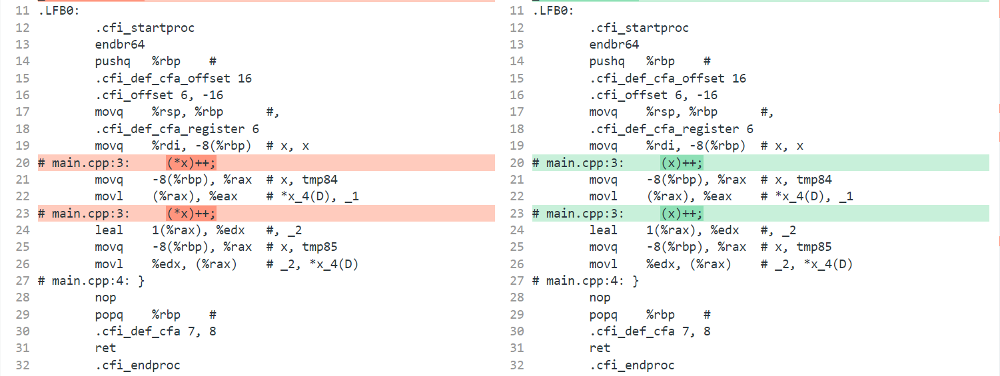

# C++中的 & 引用

下面两个代码是等价的

编译出来的汇编是一样的

```c
void increment(int *x) {
    (*x)++;
}

```

```cpp
void increment(int & x) {
    x++;
}

```

```diff
 	movq	%rsp, %rbp	#,
 	.cfi_def_cfa_register 6
 	movq	%rdi, -8(%rbp)	# x, x
-# main.cpp:3:     (*x)++;
+# main.cpp:3:     (x)++;
 	movq	-8(%rbp), %rax	# x, tmp84
 	movl	(%rax), %eax	# *x_4(D), _1
-# main.cpp:3:     (*x)++;
+# main.cpp:3:     (x)++;
 	leal	1(%rax), %edx	#, _2
 	movq	-8(%rbp), %rax	# x, tmp85
 	movl	%edx, (%rax)	# _2, *x_4(D)
```



# 如何理解

可以把C++的引用理解为指针的语法糖


